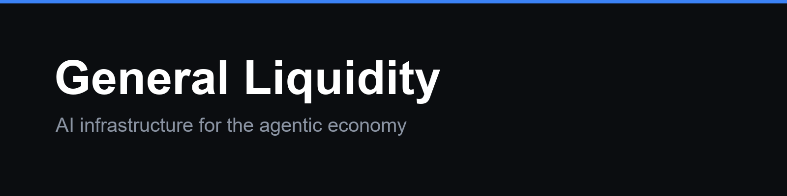

<div align="center">



# General Liquidity

**The OS for the machine economy.**

An applied research lab

[generalliquidity.com](https://generalliquidity.com) · [gordoncli.com](https://gordoncli.com)

</div>

<br />

## The thesis

The economy is being handed to actors that are not people. Agents are about to hold budgets, sign for value, and act on standing mandates, transacting at machine speed against counterparties they have never met.

[Fabric's essay on the machine economy](https://www.fabric.vc/writing/the-machine-economy) gets the shape right: compute, models, and programmable money converge until agents become economic actors rather than tools. Its sharpest observation is that once capability is abundant, "the scarce and therefore precious resource is no longer capability, it becomes direction."

We part company on what follows. That essay treats the question of who directs the flywheel as political and philosophical rather than an engineering one. It is both, and the engineering half is the part nobody is building. Direction has to live somewhere concrete: delegated, bounded, priced, and refusable. In practice that somewhere is a single API call, made by an agent, at machine speed, with no human watching it happen. Governance that cannot be enforced inside that call is not governance. It is a policy document.

So we build the **API for the machine economy**: one governed surface over payment, commerce, identity, and provenance, where an agent states an intent and a mandate decides whether it becomes an action. The agent never holds the settle primitive. Every enforcement decision is falsifiable after the fact, by anyone, offline.

We build it in the open. The applied product proves the architecture against real money. The research infrastructure is the part the rest of the field can use.

<br />

## What we build

### The applied flagship

**[Gordon](https://github.com/general-liquidity/gordon)** is a plan-first AI trading agent that brings institutional-grade discipline to retail traders. You state intent in plain language, it drafts a structured plan, you approve it, and a deny-first risk harness gates every order before it reaches a venue. Open source under MIT, local-first, no account.

```console
$ npm install -g @general-liquidity/gordon
```

<!-- repositories:start -->
<!-- Generated by scripts/update-profile-readme.mjs. Do not edit by hand. -->

### Capital markets

The environments and benchmarks behind the agent.

| Repository | Description | Stars | Issues | PRs |
|---|---|--:|--:|--:|
| [SharpeArena](https://github.com/general-liquidity/sharpearena) | A point-in-time market environment for training and evaluating trading agents without lookahead leakage. Every scenario is reconstructed from a seed so runs stay reproducible, with a language-agnostic contract agents speak. | [](https://github.com/general-liquidity/sharpearena/stargazers) | [](https://github.com/general-liquidity/sharpearena/issues) | [](https://github.com/general-liquidity/sharpearena/pulls) |
| [SharpeBench](https://github.com/general-liquidity/sharpebench) | A benchmark that refuses to reward luck. It scores agents on the Sharpe ratio that survives deflation for the number of strategies tried, and asks them to commit before the evaluation window so a result cannot be fit after the fact. | [](https://github.com/general-liquidity/sharpebench/stargazers) | [](https://github.com/general-liquidity/sharpebench/issues) | [](https://github.com/general-liquidity/sharpebench/pulls) |

### Agentic economy

The developer surface agents call to move money under governance.

| Repository | Description | Stars | Issues | PRs |
|---|---|--:|--:|--:|
| [OpenAPI spec](https://github.com/general-liquidity/general-liquidity-openapi) | The OpenAPI 3.1 contract for the governed payment surface, the source of truth every client pins to. It states who is allowed to move value, on which rail, under what mandate, and what proof comes back. | [](https://github.com/general-liquidity/general-liquidity-openapi/stargazers) | [](https://github.com/general-liquidity/general-liquidity-openapi/issues) | [](https://github.com/general-liquidity/general-liquidity-openapi/pulls) |
| [TypeScript SDK](https://github.com/general-liquidity/general-liquidity-typescript) | The hand-written TypeScript client: an agent signs and submits a payment intent and never holds a settle primitive, with a built-in operator signer for approvals, refunds, and the kill switch. | [](https://github.com/general-liquidity/general-liquidity-typescript/stargazers) | [](https://github.com/general-liquidity/general-liquidity-typescript/issues) | [](https://github.com/general-liquidity/general-liquidity-typescript/pulls) |
| [Python SDK](https://github.com/general-liquidity/general-liquidity-python) | The Python client for the same governed surface, generated from the spec so it cannot drift from the contract. | [](https://github.com/general-liquidity/general-liquidity-python/stargazers) | [](https://github.com/general-liquidity/general-liquidity-python/issues) | [](https://github.com/general-liquidity/general-liquidity-python/pulls) |
| [Rust SDK](https://github.com/general-liquidity/general-liquidity-rust) | The Rust client for the governed surface, for services that want the contract enforced at compile time. | [](https://github.com/general-liquidity/general-liquidity-rust/stargazers) | [](https://github.com/general-liquidity/general-liquidity-rust/issues) | [](https://github.com/general-liquidity/general-liquidity-rust/pulls) |
| [Go SDK](https://github.com/general-liquidity/general-liquidity-go) | The Go client for the governed surface, for backends and infrastructure that already speak Go. | [](https://github.com/general-liquidity/general-liquidity-go/stargazers) | [](https://github.com/general-liquidity/general-liquidity-go/issues) | [](https://github.com/general-liquidity/general-liquidity-go/pulls) |
| [MCP server](https://github.com/general-liquidity/general-liquidity-mcp) | The payment surface as agent tools over the Model Context Protocol: resolve a counterparty, pay under a mandate, verify a disclosure, and disclose the agent's own identity. | [](https://github.com/general-liquidity/general-liquidity-mcp/stargazers) | [](https://github.com/general-liquidity/general-liquidity-mcp/issues) | [](https://github.com/general-liquidity/general-liquidity-mcp/pulls) |
| [gl CLI](https://github.com/general-liquidity/general-liquidity-cli) | The operator command line: replay an audit log against a candidate mandate to see what it would have changed, and verify a signed chain offline. | [](https://github.com/general-liquidity/general-liquidity-cli/stargazers) | [](https://github.com/general-liquidity/general-liquidity-cli/issues) | [](https://github.com/general-liquidity/general-liquidity-cli/pulls) |

<!-- repositories:end -->

<br />

## How we work

**The model proposes. The harness disposes.** Intelligence and authority are separated by design in everything we ship. The component that reasons about an action is never the component authorised to take it.

**Open by default.** The benchmarks, environments, specs, and SDKs are public because a governance layer nobody can inspect is not a governance layer. Read the code on the paths that touch money.

**Verifiable over trusted.** Where we make a claim about what an agent knew, was allowed to do, or actually did, we would rather hand you a proof than ask for your confidence.

<br />

## Where to find us

| | |
|:--|:--|
| Website | [generalliquidity.com](https://generalliquidity.com) |
| Gordon | [gordoncli.com](https://gordoncli.com) · [Trader's Manual](https://gordoncli.com/manual) |
| Founder | [@tiberiu_toca](https://x.com/tiberiu_toca) |
| Security | [SECURITY.md](https://github.com/general-liquidity/gordon/blob/main/SECURITY.md) in any repository |

<br />

<div align="center">

**General Liquidity.** Applied product and research lab.

</div>
